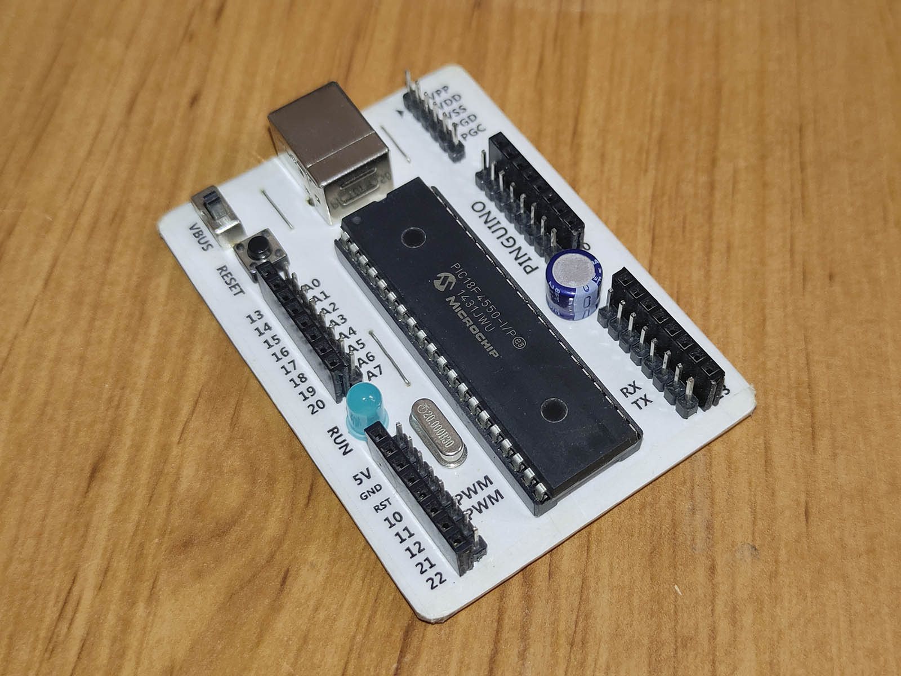
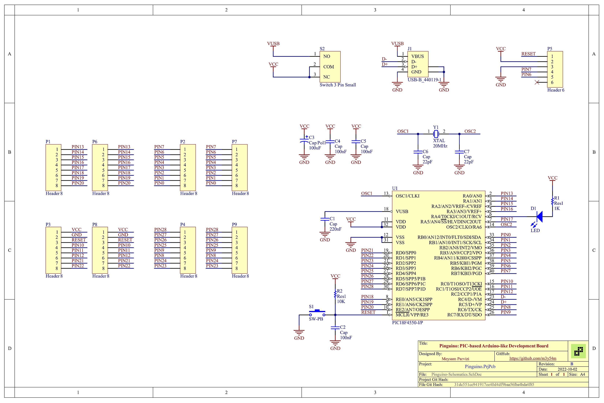

# Pinguino: PIC-based Arduino-like Development Board

Designed and built just for FUN in 2016.

The hardware design is based on: [Do-It-Yourself Pinguino PIC18F4550 Board](https://microcontrollerelectronics.com/do-it-yourself-pinguino-pic18f4550-board/)

The software required for programming the board is here: [Pinguino Project](https://pinguino.cc)

## Final Hardware

## Schematics

